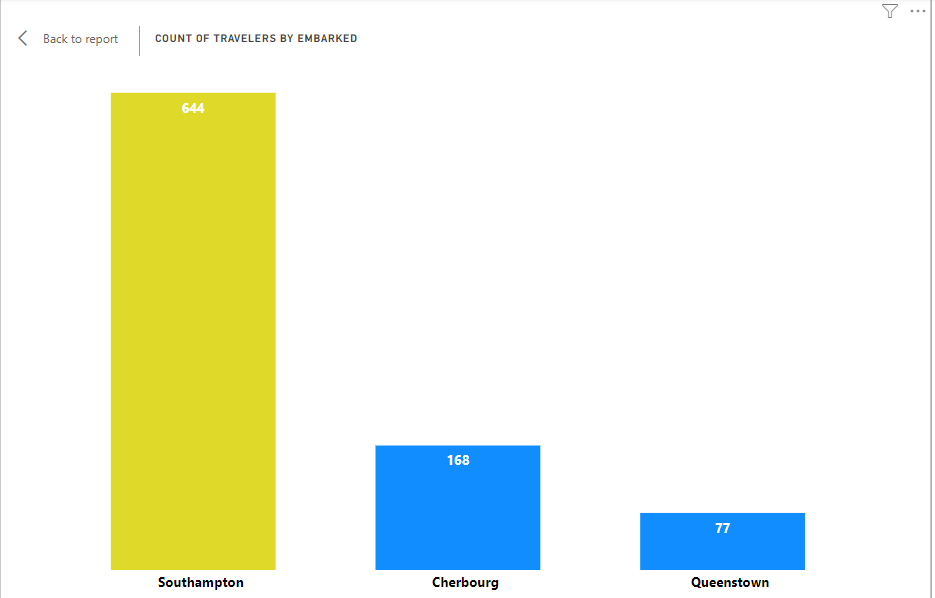

# Titanic-Analysis

___________________
##  Introduction
The Titanic was a British passenger liner that sank on its maiden voyage on April 15, 1912. It was one of the largest and most luxurious ships of its time, built by the White Star Line to provide transatlantic service. The ship set sail from Southampton, England, headed for New York City.
Tragically, on the night of April 14, 1912, the Titanic struck an iceberg in the North Atlantic Ocean, causing severe damage to its hull. Despite efforts to evacuate and save as many passengers as possible, the ship's inadequate number of lifeboats led to a devastating loss of life. 

The dataset is made up of 12 columns and 891 rows.
##  Problem statement
From the dataset obtained, I would like to look into the popular Titanic incident, and discover interesting facts about the travelers as well as some causes of the death and survival of the passengers.
Some of the questions asked are
  -  How many passengers boarded the titanic ship
  -  What was the percentage of death and of survival
  -  Who was the oldest and youngest passenger on board
  -  What was the death rate by Pclass and why
  -  What was the largest family size and what was their fate
  -  How did the locations the passengers boarded fromhave an effect on the death or survival
  -  
 ## Skill demonstarated 
In this project, a number of skills where demonstrated in other to come with the answers in mind  
   -  Data cleaning 
   -  Creation of columns
   -  Filter
   -  Quick measures
   -  Data visualization

## Data sourcing
The Dataset for this analysis was gotten from Kaggle
The dataset consists of 2 tables containing the details about the passengers and the other comments about the columns in the passenger table. The dataset is made up of 12 columns and 891 rows. It's was downloaded in csv. file and had no model, since its a sinlge table containing the details of the passengers.
Passengers details            |    Table details
:----------------------------:|:-------------------------:
   |     

## Data transformation
 The following cleaning and transformations were done using Ms.Excel and Ms.Power Bi
  - The two tables were loaded with Ms.Excel, to check out for misspelling and data duplicates, of which none was found
  - Column names were replaced with more relatable names, for example sex was replaced with Gender
  - The original column "Name" was split to three, to have Title, Last name and Other names.
  - In the survived column, the '1' was replaced with survived and '0' with dead
  - In Pclass 1 with 1st
                2 with 2nd
                3 with 3rd
  - In embarked, S with Southampton
                      Q with Queentown
                      C with Cherbourg

    Then it was imported to Power Query for more formatting, in power bi, a new column was created to house the family size of each passenger

## Visualization

-----------------------
All Visualizations for this project were done using Microsoft Power BI. The report is a single dashboard
 You can interact with the report [here](https://drive.google.com/file/d/1MLrPabOES3Bylrta_AdGofwY766tU9tE/view?usp=drive_link)
##  Data  Analysis
Microsoft power bi alongside SQL was used to derive insights from this dataset
### Survival by Gender

-------------------------------
On the titanic boat, there were more males than females that borded the ship. The Titanic ship was boarded with a total of 891 passengers(as recorded in the dataset),35% of which 
 were Female and 65% Male, that mean most of the passengers were Male. There was a total survival of 342 (38.38%) and total death of 549 (61.62%). 68% of Females survived and only 32% of the Male were fortunate. 
 
#### Survival by Location 

-----------------------------------------
A lot of the passengers where residents of southampton. This can be characteristed as the reason we have a larger percentage of the death of southampton passengers (66%) as compared to those of Cherbourg (45%) and Queentown (61%).

#### Survival by Pclass

---------------------------------------
It was observed that in every of the economic class, more females survived as compared to the Males in that class.
 - For the  1st class-  67% of the females and 33% for males  survival. A total survival rate of 63%
 - For the 2nd class -  80% of the females and 20% for males  survival. A total survival rate of 52.7%
 - For the 3rd class -  61% of the females and 39% for males  survival. A total survival rate of 24.2%
Most of the passengers in the 1st class couldn't make it, while for the 3rd class, especially the female, most of them were rescued.

#### Survival by Age

-------------------------------------
- The oldest traveler, Mr Barkworth, Algernon Henry Wilson, 80 years old, survived the wreck. He traveled in the 1st class and embarked from Southampton
- The youngest traveler, Master Thomas, Assad Alexander, less than a years old, survived the wreck. He traveled in the 3rd class and embarked from Cherbourg.

#### Survival by Family size 
           /**Family with highest Family size, family of 10,7 embarked and all dead**/ select * FROM Kaggle.Titanic where (SibSp + Parch) =(select Max(SibSp + Parch) from Kaggle.Titanic)

-------------------------------------
The family with the largest family size, Sage of 10, though 7 with 3 other family members(with different last names) embarked on the journey from Southampton, and the 7 couldn't make it. This was one of the highest family size deaths. 
A family named Anderson, also had 8 members on the trip, 7 of them died, leaving just one survival behind.

## Conclusion and Recommendation

The Titanic must have been a bad memory for a lot of this people.
Thanks to the male who were in the ship and all who risked their lifes for the survival of the passengers. They remain the **HERO** of their times.

   
    
